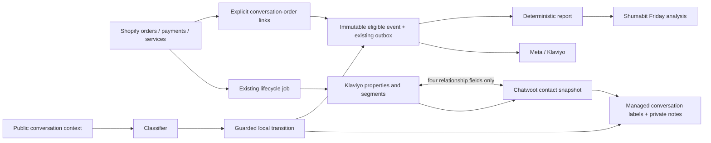

# Первый этап: подготовить систему к messaging campaigns

## Latest closure work - 5 October 2026

Use the [current closure record](UMI-STAGE-CLOSURE-2026-10-05.md) for delivery,
provider observations and remaining decisions. It links the narrow automatic
recent-intent and private command-feedback patches and the Linh/Mai handoffs.
Earlier status paragraphs below are dated evidence, not current activation flags.

## Instagram activation decision — 4 October 2026

The user requests automatic IG qualification feedback and enabled future
paid-in-chat delivery now, followed by verification on genuine events. The
[narrow activation specification](UMI-INSTAGRAM-OUTCOME-ACTIVATION-SPEC.md)
supersedes the earlier first-purchase-before-activation gate. It does not claim
Meta advertising optimization is proven. Current advertising scope is Instagram.

## Meta access checkpoint — 3 October 2026 Bangkok

Advanced access and production token authorization are complete. Graph v23
accepted an Instagram technical TestEvent after correcting the user-data key to
`ig_account_id`; the application fix and release are tracked in the
[current verification record](UMI-WEBSITE-AD-MESSAGING-INVESTIGATION.md#instagram-event-transport-verification-3-october-bangkok).
Purchase channels stay disabled until genuine eligible paid-source/provider
acceptance. TestEvent acceptance does not close that gate. The later
[release 25 acceptance record](UMI-META-RELEASE25-ACCEPTANCE.md) confirms Instagram-only
configuration validation, while launch acceptance and actual event matching remain open. Renew Page-token data access before 31 December 2026, 23:34:46 Bangkok.

## Goal Capsule

**Цель:** оператор принимает рекламные обращения, сразу понимает контекст клиента, получает автоматическую классификацию и видит связанные заказы/оплаты; Klaviyo получает корректные аудитории, Meta — только допустимые события, Shumabit — данные для пятничного отчёта.

**Граница:** Линь запускает рекламу и определяет предложения/бюджет. Мы доводим систему, не создаём рекламные кампании. Этот план заменяет незавершённые решения первого этапа в старом funnel plan и прежних readiness-документах. [Контракт данных](UMI-CRM-DATA-CONTRACT.md) — его подробный словарь. [Lifecycle decisions](UMI-CONVERSATION-LIFECYCLE-DECISIONS.md) сохраняет доказательства уже сделанных действий и правила рекламной атрибуции. При конфликте последнее решение пользователя и этот план важнее исторической спецификации.

**Средства:** существующие UMI overlay/jobs/clients в Chatwoot, native Shopify/Klaviyo integration, существующий hourly lifecycle job и scheduler Shumabit. Нового сервиса, UI, мобильного форка, permission framework или агентской сессии на каждый диалог нет.

**Historical planning snapshot, before release19 (retained for provenance):** customer fields/labels/sync, полный контекст классификатора, подтверждение оплаты в чате, service hold, отчёт и структурная очистка реализованы и прошли локальные проверки и независимые ревью. Новый релиз ещё не развернут; миграция, provider readback, проверка 40 примеров с подтверждением пользователя и включение auto остаются открытыми. Этот документ сам по себе не является production acceptance. Не объявляем всю оптимизацию Meta готовой, пока не пройдены канальные проверки ниже.

**Current status:** release19 is deployed; the 40-example quality packet and
pilot auto classification are accepted. Activation of the expanded customer-channel
scope requires channel QA, configuration deployment and runtime readback. Meta
channel/event/optimization gates remain separate and open where unverified.
Current production receipts are maintained in the
[infra stage-one readiness record](https://github.com/shumkov/umi-vps-infra/blob/main/docs/UMI-FUNNEL-STAGE-ONE-READINESS.md).

## Approved classifier channel scope — 30 September 2026

The user approved stage-one automatic classification for account 1 inboxes
**1 (Website), 2 (Facebook/Instagram), 3 (WhatsApp Legacy), 6 (WhatsApp),
7 (LINE), and 8 (Email)**. Voice inbox 5 and test inbox 9 remain excluded.
This supersedes the initial inbox-2-only scope and the deferral of these named
customer channels to stage two. **Activation requires representative channel QA,
configuration deployment and runtime readback.** Current delivery status is recorded
in the linked infra readiness record; scope approval alone is not an activation receipt.

Keep release19, `gpt-6-sol` with provider-default reasoning, accepted configuration
digest `172465d8b3d471802719e86548f0eba2045e39a2094cf3d494881f980ce77aac`,
and auto boundary `2026-09-30T08:16:26Z` unchanged. The
[classification scope and QA contract](UMI-FUNNEL-CLASSIFICATION-SPEC.md#approved-channel-scope--30-september-2026)
covers actual full-history channel representations, including Email content-only
extraction/subject and quoted-HTML limitations, and LINE sticker Markdown image
URLs without attachment records. No historical backfill, public AI reply, Meta
channel expansion or new optimization claim is authorized by this change.
Historical pilot, model-quality and provider receipts remain unchanged; the
FB/Instagram advertising pilot remains a separate reporting/attribution scope.

## Сквозная цель и порядок проверки

**Conversions API и доступная оптимизация рекламы по бизнес-результату обязательны в первом этапе.** Настроенные поля/лейблы и даже принятый Meta HTTP-запрос не закрывают этот результат. Ранний read-only prerequisite U11 выполняется до зависимой реализации: Page/IG assets, dataset, token permissions и действительная доступность нужной цели в рекламном аккаунте. Он не требует готовности U8–U10 и не создаёт кампанию, бюджет или рекламный расход.

Обнаруженное ограничение: официальная [Business Messaging CAPI documentation](https://developers.facebook.com/documentation/ads-commerce/conversions-api/business-messaging.md) описывает Instagram Purchase transport, но FAQ прямо ограничивает purchase optimization каналами Messenger/WhatsApp; Instagram предлагает conversations. Более общий [Meta Blueprint course](https://trainingworkshops.facebookblueprint.com/student/activity/652744) упоминает Messenger/Instagram/WhatsApp в контексте purchase campaigns. Это не подтверждение конкретной комбинации channel/event/objective в UMI. Приоритет точной FAQ над общим анонсом до actual-account readback; не утверждаем ни доступность IG optimization, ни её вечную невозможность. Supported QualifiedLead event также не доказывает отдельную QualifiedLead optimization goal.

Браузерная проверка 29 сентября: доступен UMI Ads 521070490831440; видны прошлые Website purchase и Messaging conversation started кампании. Events Manager показывает processed custom TestEvent на messaging dataset. Эти наблюдения не доказывают поддержку messaging Purchase/QualifiedLead optimization; кампании, черновики, бюджеты и настройки не изменялись.

| Звено пути | Что должно работать в первом этапе | Владелец проверки |
|---|---|---|
| Реклама → FB/IG DM | Реальный referral, правильный канал и scoped customer ID, новая/текущая беседа по принятому правилу | U11/U15 |
| Диалог → известный покупатель | Проверенная связь, история оплаты, customer labels/note; неизвестная identity явно ждёт связывания | U8/U9 |
| Диалог → meaningful qualification | Полный контекст, correction-only quality acceptance, auto и одна локальная note; mentions/support не создают продажу | U10 |
| Заказ → оплата | Draft checkout, ручной заказ/PromptPay, TBYB/pickup; только подтверждённая итоговая оплата | U11/U12/U15 |
| Website checkout из DM → Meta | Проверенный владелец web Purchase, корректный payment timing и отсутствие повторного messaging Purchase | U11 |
| Оплата/квалификация → Klaviyo | Точный профиль, один custom event, фактический readback, Recent conversation intent segment, отсутствие повторных flow triggers | U9/U11 |
| Оплата/квалификация → Meta | Корректный source, channel identity и dataset, единственный допустимый sender, provider receipt и доступные diagnostics | U11 |
| Meta → оптимизация | Поддерживаемая и доступная именно UMI комбинация objective/location/channel/performance goal/event, ограничения объёма/региона явно записаны | Ранний U11 prerequisite + U15 |
| Работа оператора → контроль | SLA, очередь ожидания/оценка24h, scripts/FAQ/welcome, comment coverage и пятничный отчёт | U10/U11/U14 |
| Миграция → обычная работа | Нет legacy definitions/values/writers, VIP bootstrap, отсутствие возврата старых полей после естественных циклов | U13/U15 |

Если нужная Meta goal недоступна, это launch blocker рекламной оптимизации, а не перенос на этап2. Фиксируем доступные альтернативы и возвращаем предметное решение пользователю/Линь; не подменяем purchase/qualified optimization оптимизацией на conversations без согласования. Фактическое улучшение CPA/ROAS требует запущенной кампании и объёма данных, поэтому не является обещанием результата от установки интеграции. Запуск кампании остаётся у Линь.

## 1. Product Contract: принятые решения

### Контекст и интерфейс

- **R1.** Атрибуты контакта хранят факты; управляемые conversation labels показывают их в штатном приложении; ordinary labels хранят несколько тем. Изменять вручную обе копии не нужно. Все автоматические смысловые изменения сопровождаются private note.
- **R2.** Единая видимая стадия клиента: Chooser / Seeker / Client / Repeat. Отдельная стадия диалога — unevaluated / engaged / qualified / inactive / not_sales / order_placed / purchased. Возврат не превращает Repeat в нового покупателя; новая беседа не наследует старую продажу.
- **R3.** VIP пока ручной. Один раз при внедрении назначить VIP всем текущим покупателям с >=2 подтверждёнными оплатами. Последующие вторые покупки меняют Repeat автоматически, но не назначают VIP. High value остаётся отдельно ручным. Influencer/wholesale AI вправе положительно определить по явным сообщениям; исправление оператора имеет приоритет.
- **R4.** В первом этапе не остаётся устаревших CRM-лейблов/атрибутов в Chatwoot/Klaviyo. Удаляется не только название в picker, но и сохранённые значения/назначения и писатели. Это структурная миграция, не массовая AI-разметка архива. Нативные полезные Shopify/consent/Instagram/storefront/campaign поля не объявляются legacy только из-за возраста.

### Автоматизация и коммерческие факты

- **R5.** AI оценивает новые eligible сообщения в согласованных inbox 1,2,3,6,7,8 (Website, FB/Instagram, WhatsApp Legacy, WhatsApp, LINE, Email) после проверки представления сообщений каждого канала, показывает готовую оценку на проверке, затем самостоятельно применяет status/topics/допустимые роли. Пользователь отмечает только ошибки и причины. Клиентам AI не пишет. Текущий Sol сохраняется; смена на Sonnet — этап 2.
- **R6.** Shopify владеет фактом оплаты и возврата. Draft, authorization, неоплаченный pickup/TBYB не дают покупку. Связывание клиента не означает атрибуцию всех его заказов конкретному диалогу. Один order не считается дважды через несколько каналов.
- **R7.** Klaviyo владеет поведением на сайте и аудиториями, Chatwoot — смыслом беседы. Четыре role properties синхронизируются в обе стороны; стадии/темы диалога не зеркалируются в единственный профильный intent. Согласия на маркетинг не меняются.
- **R8.** Примерка/pickup учитываются как обслуживание, отдельно от оплаты. Первый этап даёт достоверное обнаружение и исключения из обычного cart recovery; не включает новые рекламные рассылки. Attendance/no-show не выдумываем из отмены или прошедшей даты.
- **R9.** Пятничный отчёт автоматически формирует Shumabit: код считает факты, модель объясняет их и предлагает действия. Статистика скорости человеческого ответа и выполнения SLA входит в первый этап; покрытие публичных комментариев к рекламе и ответственный за них также входят в операционную приёмку, отдельно от DM-интеграции. Расходы/ROAS не выдумываем при отсутствии источника.
- **R10.** Нельзя выдавать HTTP acceptance Meta за доказанную рекламную атрибуцию/доступность оптимизации. Существующие genuine события и диагностические test events имеют разные приёмки. Не создаём фиктивные продажи.

### Settled decisions

- **Native UI + managed labels** (session-settled: user-approved, governs R1–R2): выбран вместо Vue-панели/мобильного форка; ограничение ширины меток явно принято.
- **Ручной VIP с разовым bootstrap Repeat** (session-settled: user-directed, governs R3): выбран вместо постоянного spend/AI-порога.
- **Полная очистка legacy** (session-settled: user-directed, governs R4): выбран вместо сохранения исторических aliases в интерфейсе. Before-image остаётся приватным recovery artifact.
- **Сначала качество, затем auto** (session-settled: user-approved, governs R5): correction-only review вместо ручной ежедневной модерации.
- **Отчёт Shumabit со статистикой ответа** (session-settled: user-directed, governs R9): генерация автоматическая; последняя поправка пользователя включает response-time/SLA statistics. Пользователь подтвердил внутреннюю доставку: UMI group → Orders topic; идентификаторы проверяются по текущей конфигурации перед отправкой.

## 2. Текущие факты и исследование

Проверено чтением production 29 сентября, 14:20–14:23 UTC, без мутаций, сообщений или model calls:

| Область | Доказательство |
|---|---|
| Klaviyo | 842 профиля: 580 non_buyer, 176 client, **42 repeat**, 44 unclassified. Из Repeat 27 имеют ровно 2 покупки, 15 — больше 2. Все 42 имеют свежий payment snapshot; Repeat segment также содержит 42 |
| Role properties | umi_vip/influencer/wholesale/high_value отсутствуют во всех 842 профилях; текущих отрицательных ручных значений нет |
| Chatwoot | 27 definitions; все шесть value-* имеют 0 назначений. lead-new стоит на 262 разговорах; rule 1 «Auto: tag new conversations as New Lead» активен. spam — 42 разговора/27 контактов; остальные labels не назначены |
| Старые атрибуты Chatwoot | 10 shopify_* custom fields по 64 контакта, writer — n8n enrichshopify001. Native UMI mapper хранит другое операционное представление в additional_attributes. review_sentinel — 1 тестовый след; entry_source — 51 активный storefront signal |
| Shopify services | 600 заказов; один umi_tbyb=true с date/window, отменённый/VOIDED. Cash At Store встречается в 98 заказах, не доказывает pickup. В пробе 30 новых заказов доступны fulfillmentOrders: CLOSED/NONE и CLOSED/SHIPPING; PICK_UP в этой пробе нет |
| Shopify scopes | read/write merchant_managed_fulfillment_orders, read_all_orders и orders/draft scopes доступны у существующего Shumabit app; доступ именно runtime job проверяется перед включением |
| Klaviyo flows | Один live flow — Welcome Series (Email), Added to List. Recovery flows не найдены в текущем полном списке; новые flows не включаем этой миграцией |
| Klaviyo properties | Из umi_* присутствуют только четыре используемых paid-history поля. Старых CRM role aliases в прочитанном наборе нет. Campaign/d7/travel_mp/consent/deliverability properties — другой действующий контекст, не мишень слепой очистки |

Предыдущие подтверждённые receipts: Chatwoot release14, deployed classifier shadow; ручные ссылки customer/draft/order и Shumabit private-note assistant с follow-up memory работают. Настройка multiple-conversations изменена у inbox 2,3,7. Это не доказательство готовности нового контракта или расширения AI за inbox 2.

Исследованные альтернативы: только лейблы теряют unknown/no и устойчивые отрицательные поправки; только атрибуты не видны в мобильной очереди; новая карточка/permission framework не нужны одному оператору. Для services используем уже сохраняемые order facts, а не новый reservation engine. Для отчёта — действующий scheduler, а не новый runtime.

## 3. High-Level Technical Design

Направленная схема, не обязательные имена классов:



Состояния и приоритет стадии клиента:

```text
verified repeat -> repeat
else verified client -> client
else verified non_buyer + fresh observed Seeker membership -> seeker
else verified non_buyer + fresh observed Chooser membership -> chooser
else verified non_buyer + complete membership read -> non_buyer (no label)
else unclassified / stale unchanged last snapshot with explicit freshness
```

Успешный paid update имеет приоритет над запаздывающими сегментами. Сбой чтения не превращается в отсутствие покупки/выход из сегмента. Stale data нельзя использовать как свежий send-time permission.

Граница обработки и ошибок:

```text
incoming save commits -> initial summary job (failure cannot lose incoming message)
AI proposal -> validate evidence + current correction -> local transaction:
contact/conv attributes + current conv labels + private note + pending profile update
-> other active conversations fan-out -> provider PATCH + readback
```

Блокировки contact → conversation для проекции; обычный full-label update проверяет current list под conversation lock. Closure/reopen используют ту же границу. Jobs перечитывают факты, а не восстанавливают старую payload. Klaviyo не входит в DB transaction. Приватные заметки не запускают новый sales event/ассистента.

## 4. Точный словарь, видимость и синхронизация

### 4.1 Рабочий каталог после миграции: 22 labels

- Customer stage: **chooser, seeker, client, repeat** — максимум одна.
- Relationship: **vip, influencer, wholesale, high-value** — независимы.
- Intent: **intent-size-advice, intent-color-advice, intent-product-details, intent-ready-to-order**.
- Support: **support-order-tracking, support-exchange, support-refund, support-complaint, support-after-sales, support-special-request**.
- Conversation mirrors: **lead-qualified, lead-converted**. Это действующие производные umi_sales_status, не legacy.
- **source-paid-ads**, **spam**. Подтверждённый referral не равен qualified; not_sales не равен spam.

Все восемь customer labels — только отображение. Штатный web-редактор contact attributes должен ожидать завершения update/delete и показывать возвращённую ошибку, а не преждевременный success. Допускается эта небольшая починка существующего редактора без новой панели или изменения layout. Прямое ручное изменение управляемых labels отклоняется штатной ошибкой с предложением изменить атрибут. Оператор редактирует четыре role enum в существующих контактных атрибутах; темы редактирует как обычные labels. Никакого скрытого «снял лейбл = установил no». Мобильный список может не вместить все метки; полная сводка внутри private note. Web attributes доступны в боковой панели. iOS enum-edit проверяется, при отсутствии используется штатная веб-карточка.

### 4.2 Данные контакта

| Данные | Chatwoot | Klaviyo / владелец |
|---|---|---|
| Стадия клиента | **umi_funnel_stage**, enum unclassified/non_buyer/chooser/seeker/client/repeat; read-only | Вычислена из umi_buyer_lifecycle + наблюдённого membership. Не создаём второй одноимённый профильный статус в Klaviyo |
| Число покупок/полнота/время | umi_paid_order_count, umi_paid_history_complete, umi_payment_snapshot_at; read-only | Существующие одноимённые properties; Shopify financial reducer |
| VIP/influencer/wholesale/high value | umi_vip/umi_influencer/umi_wholesale/umi_high_value, enum unknown/yes/no | Те же ключи, отсутствие/true/false; двусторонние |
| Technical paid stage / membership / freshness / pending edits | additional_attributes под UMI-owned namespace; не ещё один видимый dropdown | Источник, checked_at, конкретные segment IDs и durable per-field pending state |
| Service recovery hold | Technical projection + понятная private note при существенном изменении | umi_service_recovery_state: clear/hold/unknown; umi_service_snapshot_at, только system writer |
| Identity | Существующие Shopify/Klaviyo binding IDs | Один канонический контакт ↔ один профиль; не новый matching engine |

Paid client: ровно 1 подтверждённая покупка и полная история. Repeat: >=2 подтверждённых покупок, даже если история частична (тогда «не менее N»). Non_buyer требует полной истории. Возврат не стирает уже подтверждённую покупку. Поле **umi_buyer_lifecycle в Klaviyo сохраняется**, поскольку оно активно используется и не является legacy; в Chatwoot его исходное значение хранится технически, видимая стадия одна.

### 4.3 Sync и AI corrections

- Existing Shopify → Klaviyo commerce sync остаётся. Paid-history job дополняет его семантикой реальной оплаты; не заменяем весь Shopify connector.
- Customer context refresh каждые 15 минут и при работе с новым связанным обращением в фоне. Paid snapshot обновляется существующим hourly job; freshness менее 2 часов для подтверждённого использования. Segment observation хранит свою свежесть, не обещает мгновенный пересчёт Klaviyo.
- Чтение только configured IDs Chooser SS6aWp / Seeker RUy6Wc; перед использованием проверяем принадлежность/ожидаемую definition. Все страницы обязательны. Membership без актуального confirmed non_buyer не даёт acquisition label. Не вычисляем клики по тексту переписки.
- Four-role sync применяет только изменённые owned keys, включая false и явный unset. Перед записью — current identity/remote value, после — GET readback. Pending local edit не затирается старым poll. Для каждого поля сохраняем последнее подтверждённое общее значение (baseline), локальное pending value и его actor. Если remote равен baseline — можно отправить pending; если равен pending — подтвердить без повторной записи; если remote отличается от обоих — конфликт. Конфликт двух явных ручных изменений разрешаем в пользу текущего Klaviyo value, снимаем pending и пишем одну private note с обоими значениями; оператор может повторить нужную правку. Если у импортированного контакта ещё нет ни одного диалога, сохраняем факт конфликта (локальное/удалённое значение и actor) в существующем sync state и применяем то же правило без создания диалога; отсутствие места для note не блокирует синхронизацию. Первый будущий диалог получает обычную актуальную customer summary, без повторения старой контактной правки. Не заявляем, что знаем хронологически последнее действие. Remote false всегда отменяет pending AI-positive. Первый sync без baseline: существующее явное remote value принимается; при отсутствии remote можно отправить обоснованную локальную роль. Baseline обновляется только после успешного readback; перед подтверждением сверяем текущую identity и pending revision. Прямой внешний edit между GET/PATCH остаётся ограничением API без compare-and-set, которое нельзя обещать устранить локальной блокировкой.
- Customer-origin widget/public API create/update/delete не могут писать/удалять четыре role fields, derived funnel/paid fields или UMI-owned technical identity/sync state. Защита — узкая проверка owned keys в существующих входных путях; обычные pre-chat/entry_source поля сохраняются. Аутентифицированный оператор и системные писатели используют прежние пути, без новой permission framework.
- AI может поставить influencer/wholesale yes только из unknown при явном новом свидетельстве. Явное no не переопределяется; yes AI не снимает. Операторский reset unknown разрешает новое суждение. AI не назначает VIP/high-value.
- Custom attributes и pending sync сохраняются вместе; изменение без успешной note в текущем диалоге не считается применённым AI-решением. Никакой блокировки приёма сообщений на внешней сети.
- Проекции active open/pending/snoozed обновляются в течение минуты при здоровой очереди. Resolved — снимок последнего применения, при reopen обновляется. Владелец проекции contact/binding фиксируется для исправления ошибочной identity. Ошибочную производную связь очищаем и из закрытых, без переписывания sale events.
- Новый диалог получает локальные labels сразу, initial note после commit. Поздний match создаёт одну заметку. Unchanged poll/open-page не пишет notes. Ошибка/устаревание и восстановление дают по одной заметке на переход, не постоянный поток.

## 5. AI, рекламная связь и conversion export

### Контекст и качество

Один context builder используется в review и production. Включаем все доступные публичные текстовые сообщения текущего диалога, в том числе до collection boundary как **контекст**, проверенные customer facts и действующие operator corrections. Историю других диалогов не притворяемся прочитанной: stage1 получает текущую беседу целиком + детерминированные customer facts; Shumabit по отдельной команде может читать другие беседы.

Убираем произвольное last-20/100 как норму оценки. Явный предел безопасного provider input остаётся: если вся беседа не помещается в проверенный budget, никакой молчаливой обрезки — uncertain/context_too_large, оператору причина; не создаём отдельную LLM-summary pipeline. Attachment-only история/смысл, недоступный без изображения, также uncertain. Инвентаризация длины примеров до запуска покажет, касается ли лимит реальных текущих случаев.

Модель stage1 — существующая gpt-6-sol через текущий CLIProxy/RubyLLM. Сохраняем действующий provider-default reasoning (сейчас explicit effort отсутствует), записываем это честно как provider_default, не называем low/high. Shumabit assistant/report использует свой существующий pinned route; это отдельный вызов с собственным effort, не основание менять classifier. Версии prompt/schema/context/model фиксируются с оценкой.

Свежие post-activation входящие доказательства обязательны для нового qualification. Старые/восстановленные сообщения, private notes, новое «привет» после старого отклонённого запроса не оживляют конверсию. Темы накапливаются; снятая оператором тема не возвращается на старом доказательстве. order_placed/purchased — только Shopify. Qualified не сбрасывается AI из-за последующей поддержки/тишины.

Review packet содержит 40 существующих примеров с сохранёнными correction IDs/комментариями. Пересчитываем предложения с новым контекстом; оператор видит готовое решение и указывает только ошибки. Добавляем случаи mentions/друзей бренда, influencer/wholesale, повторного покупателя, возврата, языковой неоднозначности, частичной истории. Жёсткие отрицательные примеры не должны получить ложную квалификацию. Незавершённое/оспоренное решение не принимается по молчанию. После поправок prompt/context повторно получаем исходные предложения модели для всего набора; решения, вручную исправленные оператором, являются ожидаемыми ответами, а не доказательством качества модели. Сохраняем ошибки и расхождения повторного прогона, модель/prompt/schema/context/provider configuration version и явное принятие результата. Не требуем заявлять неизвестный effective effort: provider_default остаётся provider_default. Изменение этих входов требует новой проверки перед auto. После явного подтверждения результата — auto на согласованном allowlist inbox 1,2,3,6,7,8, с channel QA и deployment/readback по дополнению от 30 сентября. Inbox 5 и 9 исключены. Архив не размечается и не экспортируется.

### Рекламная атрибуция

Latest valid live same-conversation/channel referral at or before qualifying evidence cutoff становится локальным qualification touch; tie-break source message ID, конфликт/неизвестное время → unknown. Referral может быть на первом сообщении, qualification на более позднем. First-acquisition/cohort source хранится отдельно. Новый referral создаёт новую deduplicated private note; старый async fetch не выдаёт себя за текущий. Замороженный отправленный event не перепривязывается поздней рекламой/новой identity.

### Матрица delivery

| Путь | Stage-one действие и обязательное доказательство |
|---|---|
| Messenger QualifiedLead | Существующий adapter, genuine source → frozen event → один outbox record → accepted provider → identity/dataset readback и пригодность нужной цели |
| Instagram outcome | Проверить официальный контракт и actual app permission; добавить channel mapping только для поддержанного события с правильным scoped ID. Отсутствующее разрешение — external blocker этого канала, не общий запрет внедрять CRM |
| Website Purchase | Проверить существующий Shopify/Meta sender, момент отправки относительно оплаты, identifiers и дедупликацию с browser pixel. Не отправлять второй Purchase из Chatwoot для того же website заказа; неоплаченные TBYB/pickup не считать paid signal |
| Purchase messaging | Дополнить adapter только документированными messaging purchases с проверенной оплатой, channel identity и deduplication. Website checkout остаётся website event; не переклеиваем action_source из-за ссылки в DM |
| Klaviyo qualification / verified paid | Existing custom events, один writer; первый настоящий metric readback, затем Recent conversation intent segment. Не повторяем native Placed Order/Refunded Order как будто это ещё одна продажа |

Для Instagram/Purchase первый шаг — read-only feasibility до U8: зафиксировать endpoint/event/permissions/source eligibility и actual-account optimization goal по current official docs и реальному приложению. Код не может выдать permission. Если внешняя доступность отсутствует, отделить deployed CRM readiness от blocked Meta-optimization readiness; весь этап как fully optimized не закрывать. Не требуется запуск объявления, бюджет или фиктивная продажа ради теста. Accepted test-event подтверждает только transport.

## 6. Примерка, pickup и cart-recovery exclusions

**Новый reservation subsystem не строим.** Источник — существующие Shopify orders/drafts и выполнение оператором реальных действий.

| Случай | Надёжный сигнал |
|---|---|
| TBYB из сайта | customAttributes umi_tbyb = true; umi_tbyb_date/window — запрошенное время. Это запрос, не подтверждение визита или оплаты |
| Native store pickup | fulfillmentOrders.deliveryMethod.methodType = PICK_UP на релевантных fulfillment orders, с проверенными scopes/полной пагинацией |
| Ручная договорённость в order/draft | Один явный Shopify order/draft tag umi-service-tbyb или umi-service-pickup, только если native signal отсутствует. Оператор ставит его в стандартном Shopify UI; это service marker, не зеркалирование CRM/VIP тегов |
| Cash At Store / manual gateway / имя магазина в shipping title | Только возможная неоднозначность; недостаточно для автоматического подтверждения брони |

Жизненный цикл service: requested/unresolved → paid либо cancelled по Shopify. Для pickup без примерки fulfilled тоже завершает услугу; для неоплаченной TBYB выдача/доставка может только начинать примерку, поэтому fulfilled не снимает hold до оплаты или отмены. Архивирование, VOIDED без cancellation и прошедшая дата не доказывают, что обслуживание закончено; остаётся hold/review. Cancellation не различает no-show и nothing-kept. В отчёте эти исходы не выводим без отдельного источника.

Hourly job расширяется bounded read открытых orders/drafts и service facts; first full snapshot сверяется по текущим доступным данным. Учитываем все страницы fulfillmentOrders, scopes и async routing. При отсутствии полной видимости нельзя выставлять clear. Интеграционные события заказа в дальнейшем ускоряют refresh существующим job path, не второй расчёт покупок.

**Минимальная политика первого этапа:** при любой подтверждённой активной неоплаченной service reservation у профиля — hold обычного cart recovery для этого профиля. Это сознательно консервативно: временно удерживает и другой брошенный cart того же человека, вместо недоказанного точного matching попытки. Нет решения о скидках или отправке recovery. Неизвестная/противоречивая service history → unknown, а не clear. Полная проверка без активной брони → clear. Partial read/error не обновляет snapshot как успешный и не снимает hold. Оплаченный/отменённый заказ не создаёт нового recovery trigger.

Klaviyo exclusions используют native Placed Order с момента входа в flow (проверка перед сообщением), независимо от нашего paid lifecycle: неоплаченный checkout-created order уже является причиной остановить стандартный abandoned checkout. Draft Started Checkout без Placed Order требует отдельного trigger exclusion по фактически наблюдённой native event shape; документированное item-name правило нельзя включать вслепую. Дополнительное условие будущего recovery send: service state clear и свежий snapshot. При нездоровом global sync соответствующий flow остаётся/переводится paused; membership cache не send-time разрешение.

В текущем аккаунте recovery flows не существуют. В рамках этапа готовим/проверяем поля и точные фильтры; не создаём и не включаем отправляющие flows вместо Линь. Existing Welcome flow сохраняет свои reservation/zero-order exclusions; не заменяем все Placed Order filters на paid count. Результат U12 — готовые подтверждённые exclusions, не заявление о запущенных рассылках.

## 7. Очистка без legacy и разовое назначение VIP

### Удаляем / заменяем

| Объект | Действие |
|---|---|
| value-first-time / value-returning | Заменяем на client/repeat в актуальной проекции; удаляем старые definitions/associations |
| value-vip / value-influencer / value-wholesale / value-high-value | Целевые vip/influencer/wholesale/high-value; старых aliases не оставляем |
| lead-new, lead-lost, lead-unqualified | Удаляем definitions и назначения со всех контактов/разговоров; lead-new не переводим в engaged/qualified |
| intent-interested, intent-waiting-reply, intent-waiting-payment, source-organic | Удаляем; не выдумываем соответствующие состояния по старому label |
| Rule 1 auto lead-new | Удаляем/отключаем до очистки назначений, в конечном каталоге не оставляем мёртвое правило |
| shopify_summary, shopify_orders, shopify_lifetime_spent, shopify_last_order, shopify_last_status, shopify_order_link, shopify_customer_since, shopify_tags, shopify_address, shopify_phone | Удаляем старые custom definitions и JSON keys после проверки замены native Shopify sidebar/active mapper; retire n8n enrichshopify001 и его webhook/monitor/bootstrap |
| review_sentinel | Удаляем единственный подтверждённый disposable-test key; не ищем/не удаляем похожие бизнес-ключи |
| Klaviyo retired CRM aliases | Свежая инвентаризация не нашла их. Проверить весь список профилей, segment/flow/campaign dependencies; фактически найденные superseded CRM aliases удалить explicit unset с GET readback. Не создаём legacy keys во время миграции |

Сохраняем Instagram profile fields, meta_ad_* и raw referral evidence, umi_sales_status, entry_source, technical identity/consent/erasure fields, native payment/Shopify data и действующие campaign-content/deliverability properties. Дублирующий старый Repeat Buyers (Shopify) использует Placed Order count, а не подтверждённые оплаты: инвентаризируем использования и переносим только те consumer references, где нужен именно paid Repeat, затем убираем устаревшую funnel-аудиторию. Другие реально отличающиеся engagement/win-back/marketing audiences не считаются устаревшими атрибутами автоматически.

**Перед записью:** dry-run manifest с точными affected IDs/counts, old/new values и dependent references. Приватный before-image на VPS mode0600; в git только aggregate receipt, без customer PII. Это backup, не видимый legacy-layer. До удаления ключей проверяем покрытие native Shopify replacement: по свежей проверке 30 сентября из 65 контактов 64 имеют native customer ID, один — отдельное исключение (1388). Для него сохраняем полезный контекст или восстанавливаем только доказанную связь до удаления старых полей; не угадываем покупателя. Recovery artifact ограничен 30 днями, индексируется по account/contact/profile и очищается при действующем customer-erasure процессе. Удалённого клиента не создаём заново; существующий umi_profile_redacted запрещает восстановление и повторное заполнение new snapshots/pending/summary jobs. Это расширение существующей redaction boundary, не отдельная система доступа. Native delete attribute definition не удаляет JSON values, native rename labels асинхронен и затрагивает все ассоциации: используем явную account1 migration, не серию UI clicks.

**Порядок:** развернуть новый код с выключенными новыми projection/sync writers → приостановить конкретные старые workflows/тегирующие rules/affected queued jobs (ещё не удалять их definitions) → сохранить окончательный before-image данных и конфигурации после остановки конкурирующих писателей → изменить scoped taggings/caches/definitions/JSON → прочитать всё обратно → возобновить только новые writers → повторить отсутствие legacy после естественного цикла. Существующий n8n reverse writer не должен PATCH старый полный contact snapshot; только owned retained keys. Если он целиком заменён новой profile sync, убираем его конкурирующие записи, сохранив отдельно согласованные campaign notes/events. Не останавливаем каналы, Shopify payment collection или приём customer messages.

Cleanup не вызывает обычные label-change callbacks, публичные сообщения, conversion exports или AI replay. Contacts и conversations всех statuses охвачены, account/global tag namespace не переписываем между аккаунтами. Исходные immutable события/заметки сохраняются как история, а не активные legacy fields. Для ранее размеченного resolved snapshot не применяем сегодняшнюю стадию; неподтверждённые старые customer labels сохраняем только в private migration manifest и убираем из UI.

**VIP bootstrap:** заморозить список актуальных проверенных Repeat на момент запуска, сейчас ожидаются 42. Записать umi_vip=true в Klaviyo и в точно связанные canonical contacts; отсутствие связи не создаёт новый contact и не подбирается по имени. При последующем связывании VIP подтянется обычным sync. Существующее явное no или изменившаяся после preview identity — отдельное исключение для проверки, не молчаливое переопределение. Один migration ID и per-profile applied receipt; повтор запуска не назначает заново VIP новым Repeat и не отменяет последующие ручные исправления. Не меняем consent, high-value или суммы покупок.

Rollback — восстановить только затронутые значения, всё ещё равные записанному migration output; при поздней правке оператора остановить восстановление этой записи. До сравнения, под применимой блокировкой, проверить существование и erasure marker клиента: deleted/redacted запрещает restore даже когда оба значения отсутствуют. Связанные записи в recovery artifact также удаляются; aggregate receipt без PII можно сохранить. Не восстанавливать целую БД поверх новых сообщений/заказов, не replay conversions. Для штатной работы сохранение legacy aliases не требуется.

## 8. Пятничный отчёт Shumabit

- Время по умолчанию: **пятница 09:00 Asia/Bangkok**; период [предыдущая пятница 00:00, текущая пятница 00:00), явные UTC boundaries. Период не зависит от timezone VPS.
- Existing Shumabit scheduler добавляет один job crm-friday-report. Один wrapper получает Rails umi:funnel:report/cohorts и Klaviyo/service aggregate snapshot; сохраняет facts.json, report.md и receipt.json в reports/crm-weekly/<period-end> под закрытыми правами.
- Таблицы считаются кодом: обращения/квалификации/связанные оплаченные заказы/валюта и refunds, customer stage/role counts, доля неопределённых/matching issues, delivery failures и sync freshness. Account-wide snapshot явно отделён от периода и pilot inbox2. Не называем текущую all-account cash snapshot выручкой недели.
- Half-open report boundaries исключают задвоение события в соседних неделях. Для funnel conversion rates — одинаковый 7-дневный horizon: зрелая предыдущая когорта отдельно от ещё незрелой последней недели. Response-rate/SLA используют отдельные as_of правила ниже, не этот 7-дневный horizon. До collection boundary данных нет; первый короткий отчёт явно incomplete, не ошибка и не нулевой результат полной недели.
- Модель получает только агрегаты и ограниченный фактический summary. Шаблон закрепляет цифры; Shumabit пишет интерпретацию, проблемы и рекомендуемые действия. Не читает всю CRM переписку ради еженедельного счётчика, не выводит private customer data и не вычисляет метрики самостоятельно.
- Используем существующий pinned engine/CLIProxy путь Shumabit, не default OAuth launcher. Receipt содержит model/effort/version/as_of/source coverage. Новый независимый report session не продолжает сессию клиента.
- Устойчивый ключ period+account и existing job lock: успешный отчёт не генерируется/не отправляется повторно при retry. Model failure сохраняет facts и явный failed-analysis статус; monitoring показывает ошибку. Не отправляем выдуманную аналитику.
- 30 сентября пользователь выбрал доставку в Telegram: группа **UMI**, топик **Orders**. Перед первой отправкой сверяем точные IDs с существующей конфигурацией этого топика. Используем существующий Polygram IPC sendMessage/sendDocument, отдельный receipt. Ambiguous send timeout требует проверки marker в истории, не слепого resend. Не публикуем в customer conversations или неизвестный group/topic.
- Нет обещаний ROAS/CAC при отсутствии spend, attendance/no-show rates без источника. Публичные ad comments учитываются отдельно только после проверки их доступности; DM-статистика не выдаётся за покрытие комментариев. Фактические ограничения — часть отчёта, не повод выдумывать нули.

### Статистика ответа / SLA — включена по уточнению пользователя

В пятничный отчёт включаем время первого публичного человеческого ответа, время последующих ответов (от первого сообщения клиента в очередной серии до ответа оператора), среднее/медиану/P90, число наблюдений и обращения, всё ещё ожидающие ответа, с длительностью ожидания. Серия сообщений клиента не сбрасывает таймер. Private notes, системные сообщения, автоответы и предложения Shumabit не считаются ответом клиенту. Показываем по inbox, отдельно pilot FB/Instagram; не смешиваем покрытие всех каналов с рекламным pilot.

Сохранённое требование Линь — первый человеческий ответ в пределах 5 рабочих минут и response rate >95%. Показываем фактические значения и сравнение с этими ориентирами; расписание берём из проверенных inbox business hours/timezone. 30 сентября пользователь подтвердил **ежедневно 09:00–21:00 Asia/Bangkok**; live readback подтвердил эти часы у Website inbox1; для Facebook/Instagram inbox2 включён уже сохранённый такой же график, повторный readback успешен. У inbox2 нет out-of-office message. Без подтверждённого расписания считаем обычное календарное время и явно оставляем business-hours SLA непроверенным. Это измерение и отчёт, без нового механизма таймеров, эскалаций или Enterprise SLA-policy dependency.

Используем существующие Chatwoot ReportingEvent first_response/reply_time и публичные сообщения, проверяя их семантику: native first_response может начинаться с bot handoff, а native waiting_since может очищаться ботом. Где это расходится с человеческим ответом от начала ожидания, считаем нужный интервал детерминированно по уже сохранённым сообщениям, не выдаём native bot-adjusted metric за выбранный SLA. Reopen сам не запускает и не сбрасывает таймер: новое входящее после уже отвеченного эпизода начинает следующий; неотвеченное ожидание продолжается. Второго first response для того же conversation не создаём. Известные spam/service notifications исключаются с явным счётчиком; неизвестные source timestamps/recovered chronology отдельно как недостаточное покрытие, не нулевое время.

Недельная cohort — обращения с первым eligible входящим в [from, until), as_of фиксируется в facts. Response rate = получившие человеческий ответ к as_of / все eligible обращения этой cohort; неответившие входят в знаменатель. SLA denominator — обращения уже получившие ответ либо исчерпавшие 5 рабочих минут к as_of; ещё не достигшие порога показаны pending отдельно. Статистика длительностей включает только завершённые интервалы и обязательно соседствует с unresolved count/age, чтобы не скрывать долгие неотвеченные обращения. Для последующих ответов cohort строится по началу эпизода с теми же границами; не округляем timestamps до расчёта порога.

U14 включает проверку native report semantics и эти агрегаты; приёмка: сообщения серией, private/bot reply, ответ через границу недели, неотвеченный диалог, reopen, ночной интервал, отсутствие расписания и unknown historical timestamps. Цифры сверяются с конкретными исходными публичными сообщениями без публикации PII в weekly artifact. Дополнение прошло два независимых bounded review; устранено смешение 7-дневного conversion horizon с response-time as_of; предыдущие review receipts не доказывают реализацию этого дополнения.

### Полный операционный блок Линь

Последующее решение пользователя включает весь операционный блок R13 исходного плана. Система автоматически считает скорость/долю ответов, проверяет наличие оценки обращения в течение 24 часов и формирует пятничный отчёт. «Квалификация за 24 часа» означает получить обоснованную оценку, а не принудительно поставить qualified каждому: not_sales/uncertain сохраняют свой смысл. Неоценённые и требующие уточнения показываются отдельно с возрастом ожидания. Контроль срока не требует ручного заполнения таблиц.

Sales/product/policy scripts и FAQ берём из утверждённых материалов для оператора и предложений Shumabit; не выдумываем условия доставки/возврата/скидок. Существующий welcome проверяем на работоспособность и отсутствие двойного ответа. Публичные ответы клиентам в DM/комментариях по-прежнему отправляет оператор; автоматические предложения и статистика не расширяют права ассистента на отправку.

По комментариям к рекламе U11 проверяет доступный источник отдельно для FB/Instagram, возможность видеть входящие комментарии, ответы и их время, принадлежность рекламе, а также назначенного ответственного (текущий оператор Chatwoot). Если API-покрытие доказано, используем существующий путь сбора/отчёта; если нет — оператор работает в Meta Business Suite, а отчёт явно помечает покрытие комментариев неполным. Не считаем DM-метрики метриками комментариев и не обещаем автоматизацию ненаблюдаемого потока. Нового comment inbox/бота/сервиса этот пункт сам по себе не требует; обнаруженный необходимый adapter получает отдельный узкий implementation contract до кода.

U10/U14 проверяют 24-часовой age/status отчёт; U11/U15 — comment coverage, ответственного, доступность утверждённых scripts/FAQ и один welcome. Пятничная генерация автоматическая, прочтение отчёта и коммерческие решения остаются за человеком. Новые акции, бюджеты и маркетинговые отправки не включаются одним этим операционным требованием. Два независимых bounded review дополнения: CLEAN; это приёмка спецификации, не подтверждение работающей автоматизации.

## 9. Implementation Units

Идентификаторы продолжают исходные U1–U7 без их перенумерации. Каждая единица — ограниченный diff с подходящими regression tests и независимым code review. Код UMI — overlay/initializers, патчи отмечаются в UMI-PATCHES.md. Infra/Shumabit изменения — отдельные рабочие ветки без перезаписи грязных checkout.

### U8 — словарь и customer projection

**Covers R1–R4. Depends:** none. **Files:** existing Configuration/ConversationProjection, UMI contact/conversation concerns, label/custom-attribute/bulk write hooks, focused service/request specs. **Build:** schema provisioning, eight managed customer labels, one visible funnel field, same-lock updates/closure, projection owner, note writer, initial after-commit note. Protected fields use existing model/service boundaries and customer-origin API guards; no new ACL. Include the narrow CustomAttributes.vue await/error-message fix, without changing layout.

**Tests:** all four funnel labels mutually exclusive; repeat+VIP+refund preserves topic; unknown≠non_buyer; stale timeout preserves last facts; UI/bulk topic change races projection without silent loss; close/reopen races; invalid binding removes only its projection; incoming persists despite initial note failure; note rollback for later AI changes. Widget/public create/update/delete cannot forge or erase protected role/derived/technical fields; normal pre-chat fields remain writable. RED→GREEN: rejected contact update/delete never shows success, existing server error is visible. Verify enterprise overlay paths before editing core.

#### U8: конкретные границы реализации

1. **Schema/ownership:** расширить `umi/app/services/funnel/configuration.rb` существующим fail-on-incompatible provisioning. Восемь customer labels принадлежат новой проекции; guard защищает одиннадцать (ещё два sales mirrors и source-paid-ads), не передаёт их владение customer projector. Provisioning не удаляет legacy: это U13. Новый writer включается отдельным account-scoped rollout switch после schema/replacement checks; default disabled.
2. **Local state:** один UMI contact mutation service и customer projection concern/job. Contact snapshot/pending находится в `additional_attributes.umi_klaviyo_sync`; conversation owner/revision/summary marker — в собственном UMI technical key с явным redactor. Durable revision меняется от смыслового delta, не от каждого checked_at. Initial summary создаётся после commit по IDs; последующие применённые изменения сохраняют note в своей локальной transaction. Переиспользуем system private-message shape из `umi/app/jobs/meta/ad_context_note_job.rb`, без его подавления ошибок для transactional writes.
3. **Staff writes:** UMI prepend на `Api::V1::Accounts::ContactsController` create/update/destroy_custom_attributes. Под contact lock merge только переданных role keys, исходная native authorization сохраняется. Derived/technical values защищены. Web `CustomAttributes.vue` использует существующий single-key PATCH pattern из `components-next/Contacts/ContactsSidebar/ContactCustomAttributeItem.vue`, await update/delete и реальную store error.message. Оба native web editor отображают server errors; новый редактор не создаётся.
4. **Customer boundaries:** guards на widget/public ContactsController и nested `contact.custom_attributes` в Widget::ConversationsController → ContactIdentifyAction. Проверяем также delete key lists и разрешённые widget additional_attributes. Не придумываем отсутствующую public delete route; обычные pre-chat/entry_source остаются рабочими. Новое внутреннее sync/projection state не попадает в customer-facing HTTP или ActionCable payloads: обычный `Contact#push_event_data` сейчас включает весь JSON, в том числе в sender истории сообщений. Фильтрация охватывает widget/public history/create responses и contact-targeted message/conversation broadcasts; staff payload сохраняет нужные оператору данные, обычные widget attributes не меняются. Private note сама по себе не скрывает дублирующее состояние в JSON.
5. **Labels/bulk/schema:** conversation overlay к `Labelable#update_labels/add_labels` и incremental remove в `ActionService`; widget labels пишут напрямую и требуют своего hook. `BulkActionsController#create` отклоняет запрещённый add/remove до enqueue, затем worker повторяет проверку и применяет remove/add/status из актуального состояния вместе. Определения protected labels/attrs нельзя переименовать/удалить через generic definition controller; provisioning/migration имеет узкий внутренний путь. Только validate-after-stale-read недостаточно.
6. **Identity/erasure:** `ContactMergeAction` нельзя разрешить переносить owned JSON через generic deep_merge: сохранить authority канонического target, инвалидировать source-owned snapshot/pending и пересчитать владельцев перемещённых бесед. Erasure tombstone не исчезает при merge. Пара контактов блокируется по ID до бесед; profile advisory lock из ProfileBinding всегда берётся до contact lock, binding не вызывается из projection transaction. Расширить `shopify/customer_redaction_service.rb`/`funnel/privacy.rb` для новых technical state и marked summary notes; U13 подключает удаление внешнего before-image.
7. **Lifecycle:** status-scoped UMI around_update берёт conversation row lock через отдельно загруженную clean record, сохраняя исходную dirty instance. Contact читается обычным свежим запросом без contact lock; сохраняется фактически наблюдённая committed revision. Никакого binding/HTTP/contact mutation из этой границы. Contact→conversation остаётся порядком role/projection writer; conversation-only lifecycle не создаёт обратного захвата. Final labels строятся из locked current list с сохранением остальных dirty fields, callback/tag persistence проверяется отдельно. Creation hook после native determine_conversation_status задаёт локальную проекцию, note остаётся after commit. Read-before-write predicates требуют узких wrappers: staff/model toggle_status, message reopen/human-response guards, widget/public resolve, snoozed/auto-resolution jobs и Enterprise Captain resolution. Absolute status setters используют центральный hook. Не оборачивать mute! целиком: после resolved! он пишет contact.blocked, а такой outer conversation transaction инвертировал бы lock order.

**Точечные места проверки:** `spec/requests/umi/funnel_operator_status_spec.rb` и новый contact-context request spec; существующие label-controller/bulk/automation specs; `spec/services/umi/funnel/conversation_classifier_spec.rb`; frontend `CustomAttributes.spec.js` и ContactsSidebar attribute-item/store specs. Новые service/job specs покрывают один owner/revision и наблюдаемые business outcomes. Customer HTTP/history/websocket cases с заполненными baseline/pending/actor/segment observations подтверждают отсутствие внутренних ключей, staff case — сохранение нужного контекста. Для stale/full-hash и false-success bugs обязательно RED→GREEN. Enterprise company_id/SLA params проходят через super; тестируем настоящие overlay paths.

**Приёмка перед U9:** operator yes/no/unknown отображается ровно по контракту; nested pre-chat не подделывает признаки; stale формы не затирают другую роль; queued/bulk/topic/close/reopen не теряют темы; initial note failure не теряет входящее; subsequent note failure откатывает применённое изменение; merge/erasure не восстанавливают чужие факты. Двухсоединительный regression: contact revision N+1 ждёт closing conversation, closure фиксирует наблюдённую N, затем fan-out пропускает resolved без deadlock. Обратный reopen race и status+snooze+assignee save должны сохранить исходный смысл и все unrelated dirty values. Callback/tag persistence order подтверждается тестом до подключения всех callers.

### U9 — profile sync and segment context

**Covers R2,R3,R7. Depends:** U8. **Files:** existing KlaviyoClient/ProfileBinding, existing job scheduling, minimal owned contact sync service/specs; infra lifecycle/segment clients where shared endpoints require changes. **Build:** full paginated configured membership reads; current paid stage wins; four properties typed patch/unset/readback; persisted correction/pending state; no duplicate n8n writer.

**Tests:** yes/no/unknown roundtrip; remote false beats pending AI positive; fresh manual edit survives stale poll; explicit concurrent manual conflict follows baseline policy and produces one note; identity/pending revision changes during remote request cannot acknowledge a newer edit; incomplete pagination not empty result; Seeker/Chooser precedence and purchase immediately wins; identity change during request doesn't write other customer; no consent mutation; actual two-way readback before activation.

#### U9: конкретная реализация синхронизации

- Расширить существующий `umi/app/services/funnel/klaviyo_client.rb`: optional properties fieldset при сохранении email/phone discovery, owned boolean PATCH и `data.meta.patch_properties.unset`, complete cursor pagination. Pin новых контрактов на 2026-07-15, как infra; при смене shared revision проверить действующие events/readback. Официальные контракты: [profile](https://developers.klaviyo.com/en/reference/get_profile), [update](https://developers.klaviyo.com/en/reference/update_profile), [segment profiles](https://developers.klaviyo.com/en/reference/get_profiles_for_segment). `include=segments` у каждого профиля не используем: у него существенно ниже rate limit.
- Два configured segment→profiles сканирования с целью свежести15 минут, page size до100. После успешного сканирования next_sync_at через5 минут: существующий5-minute reconciler запускает следующий проход обычно через5–10 минут, оставляя запас до15-minute expiry; cadence не должна сама вызывать stale/recovery notes. Ошибки и429 сохраняют отдельный cooldown. Publish membership observation только после завершения обеих пагинаций. Храним для связанных контактов booleans/segment IDs/time, не копию всей чужой базы. Membership через verified profile ID; partial result не равен пустой аудитории. Это наблюдение в течение времени, не атомарный снимок Klaviyo.
- `CustomerContextSync` + `ProfileSyncJob` читают current contact/profile generation по ID и вызывают общий U8 writer с remote-origin без обратного echo. В `umi_klaviyo_sync` per-field хранится baseline_known отдельно от baseline=unknown, pending value/revision/actor и успешная observation/error metadata. Binding change очищает старый baseline/pending и меняет generation; pending edit не переносится другому покупателю.
- Role conflict table — §4.3. Никакой contact row lock/DB transaction вокруг HTTP. Наши requests сериализуются per-profile через существующий job mutex pattern; перед PATCH и local readback acknowledgement сверяются profile/generation/revision. ProfileBinding сохраняет собственный advisory→contact порядок. Уже ушедший внешний запрос нельзя отменить сменой binding; stale response не подтверждает новую revision и не переписывает новый contact context.
- Перед PATCH существующее per-role sync state фиксирует отправляемое значение/revision и точную binding identity. Проверенный GET сохраняет наблюдённое исходное значение как baseline. Если оператор изменил роль во время PATCH, следующий GET распознаёт предыдущую собственную запись и сохраняет более новую pending revision; следующий неуспешный PATCH не стирает этот baseline. На ambiguous PATCH следующий проход сначала GET/readback, без слепого повторения старой записи. Rate limit переносит due time по Retry-After, не превращается в отсутствие свойств. Нет нового generic retry framework. В customer-only HTTP/broadcast payload скрыты как technical state, так и внутренние role/paid/funnel contact fields; staff payload сохранён. Успешный segment-only refresh не отменяет profile error. Для profile/segment чтений fixed origin/no redirects/timeouts; off-origin/повторный cursor и incomplete pages дают явную ошибку.
- Identity discovery до первого sync: новое входящее сообщение, committed изменение email/phone или ожидающая локальная роль у ещё не связанного контакта вызывает существующий `ProfileBinding.resolve` из того же `ProfileSyncJob`. Только точные email/E.164 phone, один профиль и отсутствие конфликтующей local identity; без профиля ничего не создаём и не угадываем. Anonymous/redacted контакты не вызывают provider lookup. Первое связывание сохраняет локальные pending roles; смена прежнего профиля их инвалидирует. Ошибка/неоднозначность остаётся видимой в существующем sync state; 429 использует тот же Retry-After. Это не исторический backfill всех контактов.
- Существующий `config/initializers/zz_umi_funnel_events.rb` / `umi/app/jobs/funnel/reconcile_job.rb` каждые5 минут только ставит bounded due jobs с oldest-first fairness. Новый связанный incoming/role edit ставит refresh после commit. Очередь не блокирует financial/delivery jobs; размер прохода и throughput проверяются против числа связанных контактов для цели15 минут. Hourly paid-history owner в infra остаётся единственным финансовым reducer.

**Specs:** отдельные `spec/services/umi/funnel/klaviyo_client_spec.rb`, `customer_context_sync_spec.rb`, `spec/jobs/umi/funnel/profile_sync_job_spec.rb`, segment-refresh counterpart; расширить `profile_binding{,_resolve}_spec.rb`, `reconcile_job_spec.rb`, существующий `spec/requests/umi/shopify_customer_erasure_race_spec.rb`. Table cases: missing baseline vs confirmed absence; false/unset; remote AI veto; manual conflict; edit during GET/PATCH/readback; identity switch; failed second segment page; 429; duplicate jobs; erasure; no echo/consent change. Провайдерский canary проверяет scope/PATCH/unset/readback до activation, а не подменяется fixture.

### U10 — context parity, roles, notes and quality

**Covers R1,R3,R5. Depends:** U8,U9. **Files:** ClassificationClient/ConversationClassifier/ClassificationJob, transition/note helpers, existing review packet tooling, focused specs. **Build:** shared full-context builder, positive influencer/wholesale proposals, special-request topic, explicit truncation/attachment uncertainty and preserved corrections; repair review packet rather than replace answers.

**Tests:** known Repeat return; price-only vs consultation; raw Instagram mention≠influencer; collaboration→not_sales + influencer when explicit; wholesale enquiry from unknown; operator no and deleted topic preserved; huge context uncertain; old evidence never fresh qualification; shadow no applied mutations; one note per actual combined delta; no note loops. RED first for existing context/notes bugs. Quality acceptance separately from unit tests.

### U11 — referral and eligible provider delivery

**Covers R6,R10. Depends:** read-only provider/source feasibility starts immediately with no U8/U10 dependency; final AI-generated qualification activation depends on U10. Purchase/source implementation follows the reviewed origin/owner contract below. **Files:** FbigAdAttribution, AdContextNoteJob/Trigger, ConversationTransition, MetaClient/DeliveryService, existing outbox/readback specs. **Build:** same-request referral selection and repeated-ad notes; verify channel permissions/contracts before extending mapping; retain source distinctions and stable event IDs.

**Tests:** referral first message + qualification later; new referral while old lookup pending; missing/conflicting timestamp; no cross-chat source; duplicate webhooks; paid order two conversations once; Shopify website order not mislabeled messaging; genuine Meta/Klaviyo transport + separate destination identity/objective evidence. Blocked external permission is explicitly recorded, not bypassed.

#### U11: обязательная ранняя проверка и недостающие контракты

**До зависимого кода:** заполнить матрицу Messenger/Instagram × QualifiedLead/Purchase × messaging/website origin: supported event, конкретные scopes и asset grants, Page/IG-associated dataset, trusted PSID/IGSID, selectable objective/location/performance goal, eligibility conditions и источник доказательства. У existing Messenger QualifiedLead есть adapter; `delivery_service.rb` исключает Purchase/Instagram, `order_financial_state_service.rb` фиксирует order_origin=unknown. Это реальные implementation gaps, не только отсутствующий production smoke test.

**Purchase origin / один sender:** до расширения payload определить подтверждаемые признаки завершения сделки. Invoice/draft link, открытый и оплаченный в web checkout, остаётся website. Manual order + PromptPay может быть messaging только при подтверждённом завершении покупки в конкретном чате/канале; gateway/source_name/сам факт manual link недостаточны. In-store settlement TBYB не становится messaging от того, что бронь обсуждалась в DM. Unknown origin удерживает Meta Purchase, но не теряет Shopify paid fact или корректный Klaviyo event. 30 сентября пользователь выбрал команду в private note Chatwoot вместо тега Shopify. Команда указывает уже связанный заказ в текущем диалоге и подтверждает только место завершения покупки; факт оплаты по-прежнему проверяется в Shopify. Результат сообщается приватной заметкой. Точный синтаксис, хранение доказательства и отмена неподанной конверсии требуют узкого технического review до кода; новый UI и Shopify-тег не добавляем.

Website row имеет явного owner: установить, что реально отправляет Shopify/Meta integration или storefront pixel/server sender, когда он отправляет Purchase для manual-payment/TBYB, какие browser/server event IDs использует. Обнаруженные преждевременные либо двойные Purchase исправляются в том же этапе до активации нового sender. Business Messaging guide не обещает provider deduplication: наш unique outbox не спасает от второго независимого Shopify sender. Cross-sender ownership проверяется на одном реальном order, не только unit test собственного event_id.

**Meta proof имеет пять разных уровней:** (1) transport events_received/trace; (2) Events Manager нужный dataset/source/event и diagnostics; (3) доказанная исходная Page/IG+scoped identity, доступное Meta match quality только в той детализации, которую Meta показывает; (4) фактически доступная нужная optimization goal в UMI Ads; (5) attribution реального рекламного результата после существующей/запущенной Линь кампании. Не изобретаем API для индивидуального matched receipt, если доступен только UI/aggregate evidence. До рекламного трафика фиксируем integration eligibility отдельно от ещё ненаблюдаемой campaign attribution; test event не удовлетворяет (4)/(5).

**Изменяемые файлы:** `umi/app/services/funnel/{meta_client,delivery_service,delivery_automation}.rb`, `umi/app/services/shopify/order_financial_state_service.rb` и существующие attribution/manual-link seams только после origin decision; referral capture/note/transition files из U11 выше; `spec/services/umi/funnel/{provider_clients,delivery_service,automation}_spec.rb`, реальные paid/attribution regression specs. Обновляем устаревшие delivery runbook/inventory только явным current-status addendum, сохраняя исторические receipts. Не меняем immutable уже отправленные события при позднем referral/link.

**Сквозные acceptance cases:** Messenger и Instagram раздельно; ad на первом сообщении + qualification позже; последующая другая реклама; DM→website draft checkout; manual PromptPay в чате; pickup оплата в магазине; TBYB kept-items final payment/refund; paid-before-link и corrected-link; native website sender overlap; unknown origin; timed-out Meta POST не создаёт retry-sale. Klaviyo native Placed Order и custom verified paid не должны активировать два одинаковых flow; Recent conversation intent создаётся после первого genuine metric с readback.

**Критерий завершения:** по каждой согласованной optimization route документированы поддержка, разрешения, реальная отправка/diagnostics и actual-account goal. Недоступный IG goal или отсутствующее доказательство нужного goal не закрываются словом «permission», generic event accepted или готовностью CRM. Если нужна реальная история событий для eligibility, указываем точное условие и текущий объём; не создаём искусственные события ради разблокировки.

### U12 — service facts and recovery exclusions

**Covers R6,R8. Depends:** existing lifecycle job, U9 for Chatwoot context. **Files (infra):** klaviyo-shopify-sync buyer-lifecycle-sync.mjs/shared Shopify queries and focused service-state reducer/tests, lifecycle spec/runbook; Shopify manual service marker instructions. **Build:** TBYB/native pickup/manual explicit tags; aggregate clear/hold/unknown and timestamp; exact recovery filters documented against observed native draft/order events. No sending flow activation.

**Tests:** cancelled sample TBYB→not active; Cash At Store alone≠pickup; PICK_UP vs RETAIL/PICKUP_POINT; incomplete FO scope/pagination unknown; archived/VOIDED unpaid doesn't clear; tag on draft hold; partial pay still not purchase; cancellation no marketing trigger; one active reservation holds profile; errors don't refresh success timestamp. Code reports service counts only when evidence supports them.

### U13 — migration, obsolete-writer retirement, VIP bootstrap

**Covers R3,R4. Depends:** U8,U9 and replacement-context acceptance. **Files:** one bounded UMI rake migration + manifest/readback support/specs; infra n8n workflow/bootstrap and exact Netdata monitor removal; Klaviyo explicit-unset client if required. **Build:** exact inventory manifest, stop affected writers, cleanup22-label target catalog and ten old attrs, maintain privacy/identity facts; bootstrap frozen Repeat set; natural-cycle no-resurrection check.

**Tests:** 262 lead-new cleanup across statuses; same global text in another account untouched; definitions deleted AND JSON absent; old n8n in-flight write cannot resurrect; no event/note spam during bulk structural cleanup; two-run idempotence; VIP later manual no remains no on rerun; no-matching-CW-contact still updates correct Klaviyo profile; rollback doesn't overwrite later change; cleanup → customer erasure → rollback cannot recover customer values, expired/deleted/redacted before-images are purged; replacement coverage exception is reported before deleting its fields. Stage rehearsal against copied/synthetic records before production mutation.

### U14 — automatic weekly report

**Covers R9. Depends:** existing reporting, U9/U12 for added context; generation need not wait for Meta acceptance. **Files (Chatwoot):** UMI operational report service alongside existing `umi/app/services/funnel/{report,cohort_report}.rb`, aggregate rake output in `lib/tasks/umi_funnel.rake`, service/rake specs. **Files (Shumabit):** tools/scheduler/jobs.yaml, scripts/crm-friday-report.js, existing engine invocation/library and focused tests. **Build:** обязательный Rails расчёт human first/subsequent response intervals, unanswered waits, business-hours SLA и 24-hour evaluation age/status из сохранённых сообщений, classification evaluations и проверенного inbox schedule по §8. Existing Report/CohortReport этих данных не возвращают; Shumabit wrapper потребляет готовые агрегаты вместе с финансовым отчётом. Friday Bangkok job, facts artifact, deterministic tables, Shumabit interpretation, failure visibility, optional selected internal delivery.

**Tests:** timezone boundary and exact endpoint no double count; first partial week; Rails service/rake cases for response cohorts, unanswered waits, bot/private exclusions, business-hours coverage and unevaluated/uncertain/evaluated age at the 24-hour boundary; immature vs mature equal horizon; currency separation; current cash not weekly revenue; failed provider read/model; period lock and restart; successful artifact reused; no recipient means no send; ambiguous send held. Real scheduler run/readback proves installation, not just cron text.

### U15 — integration delivery and activation

**Covers R1–R10. Depends:** U8–U14. **Build:** signed release+reviewed infra deployment, precise migration/readback, mobile/web/operator checks, correction-only quality acceptance plus channel-representation QA, then auto for approved inboxes 1,2,3,6,7,8 with deployment/readback, provider receipts and report readiness. Existing Shumabit private-note summarize/follow-up regression remains private. No unrelated service restart or model migration.

**Tests:** synthetic integration scenario covers new ad DM→matched existing VIP→correct labels/note→qualified→linked order→paid→Klaviyo/eligible Meta once→Friday facts. Production acceptance may compose separately identified genuine receipts for those edges; it does not wait for one customer who happens to satisfy the whole scenario. Every receipt states the exact edge it proves; synthetic success never replaces provider eligibility/identity acceptance. Separate support-only Repeat path produces no new sale. Natural old-unresolved routing versus all-resolved new conversation, including pending/snoozed. Paid/refund acceptance uses genuine business facts, no artificial customer purchase.

## 10. Rollout / Verification Contract / Definition of Done

Execution order: early U11 provider/source/optimization feasibility → bounded technical plan/review per unit → implement/read-only verification → independent code reviews → signed candidate → migration dry-run → deploy new code with affected writers disabled → pause old writers and drain affected jobs → capture authoritative before-image → apply migration/VIP and retire old writers → enable new writers → provider/mobile checks → repaired human quality acceptance → auto activation. Frozen collection boundary is unchanged. Pause classifier mutations during structural migration; keep message/financial collection running. Keep old immutable history and before-images, not active aliases. If a step fails, retain exact receipts and stop that dependent action; don't falsely report whole-stage complete.

Required receipts:

1. **Schema:** all22 intended label definitions, zero retired definitions/taggings/JSON keys; active Shopify context still works; no identity/consent/Instagram/storefront data loss.
2. **Sync:** genuine both-direction role change + readback; membership/paid priorities; failures visible. All8 customer projections and private notes checked on web and installed iPhone (width limitation recorded).
3. **VIP:** exact frozen cohort count, current known42, per-profile applied/held results; no permanent automatic VIP rule.
4. **Quality:** existing corrections retained, fresh model proposals after corrections compared with retained human expectations and explicitly accepted, model/prompt/schema/context/provider configuration pinned; auto mode observed updating one eligible genuine conversation with private change note.
5. **Commerce:** draft/QR/manual order links and genuine paid/refund readback; no unpaid conversion or duplicate sale.
6. **Delivery:** each intended channel/event has separate supported/implemented/permitted/accepted/matched/objective-usable evidence. Messenger-only evidence cannot close Instagram/Purchase. External blockers remain visible in readiness, not hidden as optional tasks.
7. **Services:** real marker/scopes/event shape readback; recovery exclusions correct; no flow accidentally enabled. Unknown service state is not clear.
8. **Friday report:** successful scheduled generation, correct periods/numbers and human response-time/SLA statistics with explicit schedule/data coverage; delivery only selected destination, or explicitly generation-only if that's selected. Missing recipient blocks delivery only.
9. **Operational coverage:** approved scripts/FAQ accessible, existing welcome checked for duplicate replies, evaluation-within-24h coverage reported; FB/Instagram ad-comment source and reply coverage verified or explicitly incomplete with Meta Business Suite owner.
10. **Migration:** next natural writer cycles do not recreate deleted fields/labels; test-only review_sentinel removed; old enrichment workflow and monitor gone; unrelated live Welcome flow/campaign properties unchanged.

No full-stage completion while a required receipt is missing. Distinguish **CRM ready for receiving campaigns**, **AI auto accepted**, **Meta optimization verified**, and **internal report operational**; a partial status must say which is missing.

## 11. Non-goals, unresolved inputs and review

Stage2: bulk historical AI classification, Sonnet/model migration, customer-facing Shumabit, Chatwoot-side order creation, broad influencer outreach, AI channels outside the explicitly approved stage-one allowlist, opportunity engine. Source ad spend/ROAS and reliable no-show/attendance measurement are separate follow-ups, not invented metrics. Response-time/SLA measurement is in stage1; automatic marketing-flow activation and autonomous public comment replies are not included; ad-comment coverage/ownership verification is part of stage-one operational acceptance. The native mobile Reel translation bug stays a separately diagnosed upstream issue, not an excuse for a mobile fork.

Report destination is settled: UMI group → Orders topic. No remaining user input for schedule or destination; verify current transport IDs before delivery. Default time/horizon are stated, editable routine settings. VIP/manual policy and cleanup authorization are settled. Unknown profile identities are handled as explicit per-record exceptions, not guesses and not a block on other records.

Implementation readiness is per unit: U8 persistence seam is selected but needs regression proof; U11 purchase-origin evidence/website sender ownership and actual optimization route must be concretized and reviewed before their dependent code. External facts still to verify during bounded implementation prerequisites: Instagram/Purchase permissions and actual provider contract, recovery native draft event shape, live dependencies of deprecated Klaviyo audiences, replacement Shopify-context coverage before retiring enrichment. These checks have concrete owners U11/U12/U13; a failure narrows only the dependent activation and must be reported.

**Review status:** the baseline received six independent native reviews (coherence, feasibility, scope, native UX, security, adversarial), three verified claude-opus-5-5/high cross-model reviews and one fresh independent contract check completed. Retained fixes: native editor awaits/reported errors, customer-origin owned-key protection, erasure-aware recovery/expiry. Author reconciliation additionally made sync baseline/conflict handling, final model rerun, quiescent migration ordering and composable genuine acceptance explicit. Rejected scope expansions: new permission/credential systems, benefit-eligibility workflow, interpreting incomplete purchase history as complete, or silently accepting stale managed-label writes. Bounded rereviews of native-editor/sync/migration/acceptance and erasure/cleanup corrections returned CLEAN. Detailed receipts remain in the private review scratch directory; this paragraph records disposition without creating another competing spec.

The 29 September deepening received six fresh native reviews and three separate claude-opus-5-5/high reviews (security, adversarial, whole document; served model confirmed). Source checks retained two corrections: U8 customer-egress filtering for new internal state, and required Rails operational aggregates/service tests in U14. Both bounded correction rereviews returned CLEAN. No new permission framework, recurring human moderation, arbitrary export delay, or sending recovery flow was introduced. Meta goal eligibility, purchase-origin evidence and website sender ownership remain explicit early U11 prerequisites, not resolved by reviewer agreement. Planning readbacks/reviews are not implementation or production acceptance.

## Sources

- Local: UMI-CRM-DATA-CONTRACT.md; UMI-CONVERSATION-LIFECYCLE-DECISIONS.md; UMI-FUNNEL-{CLASSIFICATION,DELIVERY,COHORT-REPORT}-SPEC.md; app/models/label.rb, app/services/labels/{update,destroy}_service.rb; custom_attribute_definitions controller/model; existing UMI funnel/Shopify code.
- Infra: docs/UMI-FUNNEL-STAGE-ONE-READINESS.md; ansible/roles/klaviyo_sync/files/klaviyo-shopify-sync/lib/{buyer-lifecycle,funnel-segments}.mjs; n8n/shopify-enrichment-workflow.json and klaviyo-to-chatwoot-attributes.json.
- Theme try-on worktree: assets/tbyb.js and docs/TRY_BEFORE_BUY_ADMIN_SETUP.md; active storefront entry_source in assets/assistance.js. Shumabit: tools/scheduler/jobs.yaml/lib/cron.js, Chatwoot engine route and deterministic report tasks.
- [Shopify fulfillment-order access and asynchronous routing](https://shopify.dev/docs/api/admin-graphql/latest/objects/FulfillmentOrder), [delivery method types](https://shopify.dev/docs/api/admin-graphql/latest/enums/DeliveryMethodType), [pickup workflow](https://help.shopify.com/en/manual/fulfillment/setup/delivery-methods/pickup-in-store).
- [Klaviyo Shopify event semantics](https://help.klaviyo.com/hc/en-us/articles/115005080447), [flow filters](https://help.klaviyo.com/hc/en-us/articles/115002779411), [draft recovery exclusions](https://help.klaviyo.com/hc/en-us/articles/12278373016603), [explicit property unset](https://www.klaviyo.com/blog/solution-recipe-25-append-unappend-and-unset-custom-properties-programmatically-with-klaviyo).

### Production acceptance correction — nullable payment count (30 September)

The first full profile refresh found 13 exact-linked profiles whose current
Klaviyo properties were `umi_buyer_lifecycle=unclassified`,
`umi_paid_history_complete=false`, a fresh payment timestamp, and no
`umi_paid_order_count` key. The lifecycle sender deliberately writes null when
Shopify identity/payment history cannot establish a count. Klaviyo clears a
property set to null ([Update Profile](https://developers.klaviyo.com/en/reference/update_profile));
Chatwoot's required-key read instead treats this valid unknown-history snapshot
as stale. That can retain a previous buyer projection incorrectly.

Normalize an omitted count to unknown only when the explicitly present lifecycle
is `unclassified` and history-complete is false. Keep count unknown, never zero.
All other missing required fields, missing counts for buyer/non-buyer snapshots,
and expired timestamps retain the existing stale behavior. Apply the fresh
unknown snapshot through the existing mutation/projection path so old Client or
Repeat labels clear and the operator receives the ordinary private summary.
Do not alter role resolution, identities, consent, events or provider properties.
An alternative numeric sentinel or new status field is rejected: it changes the
shared data contract unnecessarily. Defaulting every absent count to zero or nil
is rejected because it would accept malformed buyer evidence.

Verification: reproduce the exact provider shape in the sync spec, starting
with a previously confirmed buyer projection; observe failure before the fix,
then verify unclassified/unknown count and removal of the old buyer label after
it. Cover malformed missing-count buyer data, explicit nil and a stale timestamp.
Run the related sync/projection tests and independent reviews, then release
through the existing immutable-image infra procedure. Re-read the affected
production profiles after their normal refresh without changing provider facts.

### Quality correction — qualification evidence and historical topics (30 September)

The first complete full-context run returned 40 valid proposals. Independent
blind review found no hard-negative false qualifications, but samples 16 and 22
included later support-only messages in qualification evidence. That violates
the existing evidence-only rule and can move the qualification time/referral
cutoff. Sample 30 omitted a supported historical wrong-shipment complaint.

The reviewed minimal correction clarifies the prompt: use a small sufficient set
of fresh buying evidence, exclude support-only follow-up from status evidence,
and evaluate topics across the full conversation while respecting removals.
Pre-purchase delivery/care/returns consultation may still qualify. No additional
model stage or heuristic semantic validator is introduced. Policy/prompt version
3 binds a fresh configuration digest. Two independent reviews accepted this
approach after narrowing the wording to after-sales-only exclusions.

A private regression evaluation fails on the original proposals for all three
observed defects. Re-run the complete 40 over identical frozen contexts; require
16/22 to retain genuine qualification without the identified support-only IDs,
and 30 to retain non-sales collaboration plus its supported complaint. Review
all evidence semantics and hard negatives, preserve every original artifact,
and obtain explicit operator quality acceptance before automatic application.
This is a clarification of agreed semantics, not a new campaign or sending scope.

The version-3 rerun fixed all three earlier defects, with independently checked
evidence. It exposed two further review corrections: automatic story-only notices
in sample 11 must remain uncertain, and availability enquiries in sample 12 need
the product-details topic. Sample 37's basic delivery question is a qualification
threshold ambiguity; the operator subsequently delegated clarification and
accepted our engaged interpretation for a basic delivery enquiry. This is not
acceptance of the complete quality packet or automatic activation.

Version 4 clarifies basic shopping enquiries versus substantive consultation,
product-availability topics, and wholly automatic story/attachment histories.
Two independent domain reviews narrowed the wording to preserve collaboration
precedence, authored replies, mixed histories and real fit consultation. Private
evaluation is RED on 11/12/37 under version 3. Verify the complete unchanged
40-context set with version 4, retaining the earlier evidence/complaint gates
and genuine buying cases. No automatic application follows without explicit
quality acceptance; this does not add message-count qualification heuristics.

Version 4 passed the earlier targeted corrections but returned engaged on
sample 36, initially reviewed as evaluating an offered size against personal fit
needs and then asks about that alternative. The run stopped and its original
result remains preserved. Version 5 makes the positive consultation boundary
explicit: responding to relevant advice while evaluating a specific item or
alternative against fit or usage needs qualifies without an order commitment.
Remaining undecided does not erase that consultation; stating a desired size
or colour only for a stock check remains engaged. Two independent reviewers
confirmed the distinction against the complete examples 36 and 37. Verify a
new immutable full-context run against all existing gates, reviewing connected
evidence rather than treating a size statement alone as qualification.

Adjudication after the version-5 result: both independent reviewers withdrew
the mandatory-qualified expectation for sample 36. Asking the price of an
alternative after unsolicited staff fit advice supports interest, but does not
unambiguously establish customer-led evaluation of suitability. Engaged is a
defensible conservative answer; qualified was also defensible under the broad
wording. Preserve this disagreement and prior results. Do not add an exact
few-shot to force a preferred result or count this as a hard-positive regression.
Retain the general prompt clarification; continue the full unchanged review
with strong buying positives, hard negatives and evidence gates unchanged.
Record this boundary case separately in the operator review packet.
