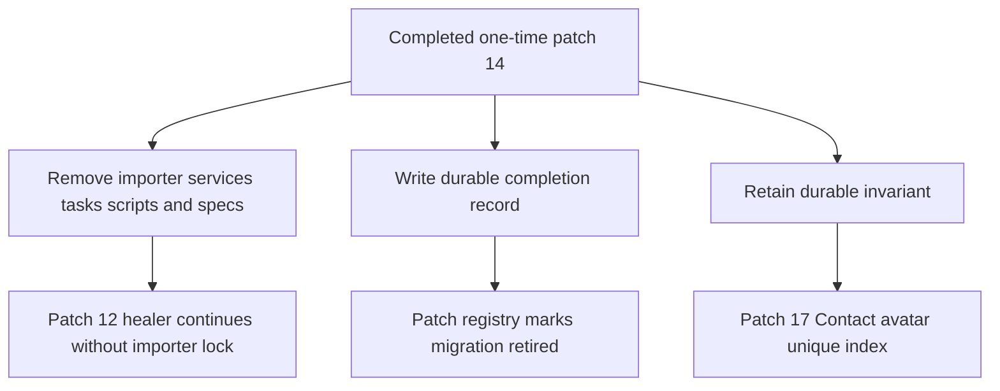

# refactor: Retire the completed FB/IG history migration

## Goal Capsule

- **Objective:** Close patch 14 after the production migration by removing its one-off executable surface, preserving the independently useful database invariant, and recording the exact achieved production outcome.
- **Authority:** The final production evidence and the user's explicit no-successor decision override the earlier runbook's normal terminal-zero-write sequence. Repository and fork safety rules govern the cleanup.
- **Execution profile:** One focused UMI patch and PR into `umi`; no production data mutation, Meta history scan, image switch, or deployment belongs to this closeout.
- **Stop conditions:** Stop if deleting a candidate file breaks an ongoing FB/IG path, if the retained avatar index blocks ordinary replacement behavior, or if documentation would overstate the completed migration evidence.
- **Tail ownership:** The implementation run owns independent spec/code review, tests, signed commit, PR, CI, merge, and post-merge verification.

---

## Product Contract

### Summary

The production FB/IG history and profile migration is complete, but the fork still ships approximately 25,000 lines of one-time importer, approval, recovery, and operator code whose own remove-when condition now applies. The active runbook and patch registry also describe terminal scans that were deliberately not run. The fork should retain the production outcome as an honest historical record while removing code that must never be casually replayed.

### Problem Frame

Leaving the migration machinery active creates three risks: a future operator can mistake a completed one-time task for supported runtime functionality; stale release/evidence assumptions will drift; and unrelated FB/IG maintenance must carry a large, high-risk rebase surface. Deleting everything blindly is also wrong because the partial unique Contact-avatar index protects a generally valid `has_one_attached` invariant.

### Requirements

- R1. Remove all one-time patch 14 runtime services, rake tasks, generated operator programs, support scripts, and their implementation-only specs from future images.
- R2. Preserve ongoing patches 8–13, including reconciliation and auto-heal behavior, while removing the importer-only lock branch that no longer has a competing archive writer.
- R3. Retain the applied Contact-avatar uniqueness migration, schema index, and invariant spec unless review finds a concrete incompatibility with current Chatwoot behavior.
- R4. Replace the active migration runbook/spec surface with a concise completion record that states the exact production totals, accepted writeful Instagram successor exception, explicit absence of a later convergence scan, profile result, full 681-row read-state audit, release identity, and sealed evidence location/checksum.
- R5. Update `UMI-PATCHES.md` and the ongoing reconciliation spec so no active documentation claims that the retired importer or its old terminal-zero-write sequence remains available.
- R6. Review the complete FB/IG patch stack for dangling constants, stale comments/status values, cross-patch coupling, untested retained behavior, or temporary production adapters accidentally promoted into permanent code.
- R7. Merge the closeout through the fork's normal signed `UMI:` commit and PR flow, with focused tests and CI green.
- R8. Keep the completion record aggregate-only: no names, handles, contact/message/account identifiers, tokens, URLs, raw logs, backup contents, or other production payloads may enter Git or PR output.

### Scope Boundaries

- No additional Messenger or Instagram history scan.
- No production profile rerun, read-state mutation, release switch, deployment, or evidence rewrite.
- No changes to the imported archive rows or their `umi_history_import` markers.
- No cleanup of the untracked `scratchpad/` directory; it is excluded from the PR because existing untracked work cannot be discarded without separate explicit authorization.
- The historical implementation remains recoverable from Git history and production's root-only evidence bundle; the repository does not keep an executable duplicate solely as an archive.

### Acceptance Examples

- AE1. A fresh Rails boot and the reconciliation/heal specs succeed after patch 14 constants and rake tasks are gone.
- AE2. The reconciliation healer still fetches and replays a missing inbound message after the importer-only lock wrapper is removed, while retaining its existing deduplication and error-redaction behavior and serializing concurrent heals for the same channel/platform/mid.
- AE3. Repository search finds no active references to the retired importer, profile runner, production-first manifests, or generated history programs outside the completion record and protected historical plan.
- AE4. The completion record reports Messenger `68/0/0`, Instagram `613/0/0`, and global `681` for total/unread/not-resolved, with zero repair, and explicitly says no successor-2 scan occurred.
- AE4a. The record says the audit selected the full set with `jsonb_exists(additional_attributes, 'umi_history_import')`; all 681 rows were resolved and satisfied `agent_last_seen_at >= last_activity_at`. The six malformed/ownership marker rows stayed inside that full set and were not rewritten.
- AE4b. The record states the seven sealed profile targets produced six fixes and one Meta-unavailable result, and that 493 marker contacts had an avatar after the pass.
- AE5. The merged `umi` tree contains the closeout commit, has no open closeout PR, and CI is green.

---

## Planning Contract

### Key Technical Decisions

- KTD1. **Retire instead of generalize.** Patch 14 was designed as a manual one-time migration and its registry remove-when condition is satisfied. Generalizing it into a supported importer would add a new product commitment without a current use case.
- KTD2. **Remove the cross-patch lock with the importer.** `HistoryImportLock` only prevented patch 12 auto-heal from racing patch 14 archive writes; live webhook writers never acquired it. With the importer gone, remove that lock and the healer's `history_import_running` branch rather than preserving an ownerless abstraction. Keep the class-only `heal_error` logging and use a narrow per-channel/platform/mid owner lock to preserve healer-to-healer serialization around the non-atomic existence check and replay.
- KTD3. **Keep the database invariant.** The partial unique Contact-avatar index prevents duplicate `has_one_attached` rows across ordinary live and healer writers, so it remains useful after the importer is removed.
- KTD4. **Keep evidence, not executable archaeology.** Replace the three active importer documents with one concise immutable completion record. Git history and the sealed production bundle retain implementation/evidence detail without shipping thousands of replayable lines.
- KTD5. **Describe the exception exactly.** The writeful Instagram successor remains an accepted operator exception with no later convergence scan; it must not be reclassified as a normal zero-write terminal result. (session-settled: user-directed — chosen over another Instagram history scan: the user explicitly ended history scanning and accepted the current evidence.)
- KTD6. **Classify the complete patch-14 delta.** Delete the one-time services/tasks/scripts/specs and three active operator documents; remove the explicit reconciliation-window API that existed only for migration checkpoints; retain the Contact-avatar index as independent patch 17, lazy Team validation-message evaluation (a general localization fix), the reload-stable `Umi::Call` spec assertion (test-only robustness owned by patch 4), and both protected plans under `docs/plans/`.
- KTD7. **Activate lock removal only with importer removal.** The currently deployed image still contains both importer and healer lock behavior. A future deployment of this closeout must first verify no importer process/job is running and must deploy the removal of both writer and lock together. Sealed root-only historical programs are evidence, not supported executable input.

### Authoritative closeout oracle

- Production Rails and Sidekiq: commit `7570ec0489bb6d79cbb012f36a6d8f0b8957b82e`, image `sha256:507e113873ca4b560921cccf5777ea4753d186556614bb23158356b801c3b33a`.
- History totals: Messenger 52 created archives / 633 messages; Instagram 607 created archives / 8,408 messages. Instagram successor-1 added four historical messages and was accepted as a writeful exception; no successor-2 was run.
- Profiles: seven sealed targets, six fixed and one Meta-unavailable; 493 marker contacts had an avatar after the pass.
- Full marker audit: 681 total; Messenger `68/0/0`, Instagram `613/0/0` for total/unread/not-resolved; zero unsupported platforms, zero null last activity, zero repair. Six malformed/ownership marker rows remained included and satisfied the read-state predicate.
- Sealed completion root: `/opt/umi/fbig-ops/profile-completion-20260801T060110Z`.
- Completion evidence JSON SHA-256: `d87c6556420de482426a355f4dc24f0b3cfd21203d3ebfedb03803f5e223fe68`.
- Completion manifest SHA-256: `4ec2a4df2bba39f4c4ec9a245a17a6ad61239adb1c7d96f9bd76a259a14a8a2b`.
- The repository record may contain only these aggregate facts and non-secret locators/checksums; it must not copy raw evidence contents.

### High-Level Technical Design

### Alternatives Considered

- **Leave patch 14 in place and only update the runbook:** rejected because it leaves a large unsupported replay surface in every future image and contradicts the patch's remove-when contract.
- **Merge the temporary direct production runner:** rejected because it encoded exact production exceptions and cursor-resume mechanics for one completed operation; promoting it would make instance-specific behavior permanent.
- **Keep the shared lock with the healer:** rejected because its only competing writer was the importer; retaining it would add a Redis lease and stale failure mode without serializing live webhooks.
- **Delete the avatar index with the importer:** rejected because ongoing live and healer builders can still attach contact avatars, so the database invariant remains independently useful.

### Risks and Mitigations

- **Hidden dependency on a removed constant:** use whole-repository reference scans, Rails eager load, and focused FB/IG specs after deletion.
- **Healer behavior drifts when its wrapper is removed:** pin successful replay, deduplication, content-unavailable, and class-only error logging in the retained healer specs.
- **Historical record overclaims completion:** bind the record to exact counts, exact release/image, sealed evidence SHA, and the explicit no-successor qualification.
- **Old and new writers overlap during deployment:** before activating the closeout image, verify there is no running or queued importer; deploy importer and lock removal together. The code-only PR does not itself change production.
- **Sensitive evidence leaks into Git:** allow only the aggregate oracle above, inspect the final diff, and run repository secret scanning before commit.
- **Large deletion obscures a small retained regression:** review the resulting diff by retained runtime paths as well as by deleted surface, and run independent correctness, reliability, security, and scope reviews.

---

## Implementation Units

### U1. Retire the one-time executable surface

- **Goal:** Remove patch 14 code that has no supported post-migration caller.
- **Requirements:** R1, R2, R3, R6.
- **Dependencies:** None.
- **Files:** `umi/app/services/fbig/`, `lib/tasks/umi_fbig_history_import.rake`, `script/umi_fbig/`, `spec/services/umi/fbig/`, `spec/script/umi_fbig/`, `spec/lib/tasks/rake/`, `spec/umi/fbig_full_history_runbook_spec.rb`, `db/migrate/20260724000000_add_unique_contact_avatar_attachment_index.rb`, `db/schema.rb`, `spec/models/active_storage/attachment_contact_avatar_constraint_spec.rb`.
- **Approach:**
  1. Delete the explicit importer/profile/approval/evidence-only file manifest established by repository audit and its tests; do not bulk-delete the shared service/spec directories.
  2. Keep ongoing reconciliation, heal, participant-name, and avatar-index files.
  3. Remove the healer's importer-lock wrapper and stale skip reason while preserving redacted error logging; replace only its incidental healer-to-healer serialization with a narrow owner lock for the same channel/platform/mid.
  4. Remove `ConversationReconService`'s migration-only explicit `window_start`/`grace_end` interface and its two checkpoint tests, returning the service to its scheduled 48-hour behavior. Retain its independent page-budget test cleanup.
  5. Retain `app/models/team.rb` and `spec/umi/call_spec.rb`, assigning them explicitly to the general Team-localization patch and voice patch 4 respectively in the registry.
- **Patterns to follow:** `umi/app/services/fbig/message_heal_service.rb`, `umi/app/services/fbig/conversation_recon_service.rb`, and the pre-patch-14 healer flow in Git history.
- **Test scenarios:**
  - Covers AE1. Eager loading the application after deletion resolves all surviving UMI constants.
  - Covers AE2. A missing inbound message is fetched, replayed, stamped, and reported without the retired importer lock.
  - Existing deduplication, content-unavailable handling, and class-only error logging remain unchanged.
  - The avatar uniqueness spec continues to reject duplicate Contact-avatar attachments while permitting unrelated Active Storage rows.
  - Replacing an existing Contact avatar through the ordinary Active Storage association succeeds, points to the new blob, and leaves exactly one attachment.
- **Verification:** No active one-time task/program is present; retained FB/IG runtime specs pass and repository reference scans show no dangling dependencies.

### U2. Record the exact production closeout

- **Goal:** Make repository documentation match the completed operation and the supported post-migration surface.
- **Requirements:** R4, R5, R6.
- **Dependencies:** U1.
- **Files:** `UMI-PATCHES.md`, `docs/UMI-FBIG-RECON-SPEC.md`, `docs/UMI-FBIG-HISTORY-MIGRATION-RECORD.md`, `docs/UMI-FBIG-HISTORY-IMPORT-SPEC.md`, `docs/UMI-FBIG-FULL-HISTORY-EXPANSION-SPEC.md`, `docs/UMI-FBIG-FULL-HISTORY-RUNBOOK.md`.
- **Approach:**
  1. Replace the active patch 14 row/detail with a standalone patch 17 for the retained Contact-avatar invariant, and remove all documentation of a surviving importer lock.
  2. Delete the obsolete executable runbook and implementation specs, replacing them with one short completion record.
  3. State exact production evidence and limitations without copying PII or rewriting legacy evidence.
- **Patterns to follow:** The patch registry's concise what/why/remove-when format and production outcome notes already used for other completed UMI operations.
- **Test scenarios:**
  - Covers AE4, AE4a, and AE4b. A deterministic documentation check finds every required history/profile/read-state count, release identifier, both evidence SHAs/path, full marker-selection predicate, and no-successor qualification.
  - Active docs contain no command that invokes a retired `umi:fbig:history_*` task or generated `script/umi_fbig` program.
  - The reconciliation spec and registry contain no `HistoryImportLock` or `history_import_running` dependency and describe the retained avatar invariant.
  - Final diff/secret scan shows no raw production payload, identifier, credential, or log fragment was added.
- **Verification:** Documentation and patch registry describe one coherent post-migration state and all named active paths exist.

### U3. Review and ship the closeout

- **Goal:** Prove the retained FB/IG stack is coherent, minimal, tested, and merged into `umi`.
- **Requirements:** R6, R7.
- **Dependencies:** U1, U2.
- **Files:** The complete branch diff plus surviving patch 8–13 files named by `UMI-PATCHES.md`.
- **Approach:** Run independent correctness, reliability/operations, security, test, and scope reviews; apply only deletion-induced breakage, dangling patch-14 coupling, and evidence inaccuracies in this PR; record unrelated retained-stack improvements separately. Run focused Ruby checks; create one signed `UMI:` commit; open a PR into `umi`; watch CI; squash-merge using the repository's normal UMI flow; then verify the merged tree matches the reviewed branch patch and verify the final `origin/umi` commit identity/signature rather than requiring the source commit to remain reachable.
- **Execution note:** Review retained code, not only changed lines, because the goal is to find old cross-patch hacks that a deletion-only review could miss.
- **Test scenarios:**
  - Covers AE3. Search-based retirement checks find no live one-off surface or stale references outside the explicit historical-plan allowlist: `docs/plans/2026-07-24-001-feat-fbig-full-history-expansion-plan.md` and this closeout plan.
  - Covers AE5. PR checks are green, the PR is merged, and the merge commit is reachable from `origin/umi`.
  - Existing patch 8–13 focused specs pass without skipped examples.
- **Verification:** Independent reviewers report no unresolved P0/P1 findings; all eligible P2 fixes are either applied or durably explained; merge and post-merge checks succeed.

---

## Verification Contract

| Gate | Applies to | Done signal |
|---|---|---|
| Repository reference and path audit | U1, U2 | No active one-time constants, tasks, scripts, or stale documentation references remain outside the completion record and the two explicitly named protected plans |
| Focused reconciliation, healer, and avatar specs | U1 | All examples pass with zero skips |
| Rails eager-load/boot check | U1 | Application loads without missing UMI constants |
| FB/IG patch 8–13 focused spec set | U3 | All selected examples pass with zero skips |
| Ruby lint for retained/changed files | U1, U3 | No offenses |
| Independent document and code review | U2, U3 | No unresolved must-fix findings |
| GitHub PR and CI | U3 | PR into `umi` is green and squash-merged; `origin/umi` has the reviewed tree/patch identity and the final commit signature is verified |

---

## Definition of Done

- Patch 14's one-time executable surface and implementation-only specs are absent from the merged `umi` tree.
- Patch 12 reconciliation/healing retains its tested replay, deduplication, same-mid serialization, and redacted failure behavior without a dead importer-lock dependency.
- The Contact-avatar partial unique index and its invariant coverage remain intact as standalone patch 17.
- `UMI-PATCHES.md` and active FB/IG docs describe the supported runtime surface without referencing runnable migration tooling.
- `docs/UMI-FBIG-HISTORY-MIGRATION-RECORD.md` preserves the exact production result and its no-successor qualification, including the full 681-conversation read-state audit.
- Independent spec and code reviews have no unresolved must-fix findings.
- The signed `UMI:` closeout commit is merged into `umi`, CI is green, and the authoritative remote state is verified.
